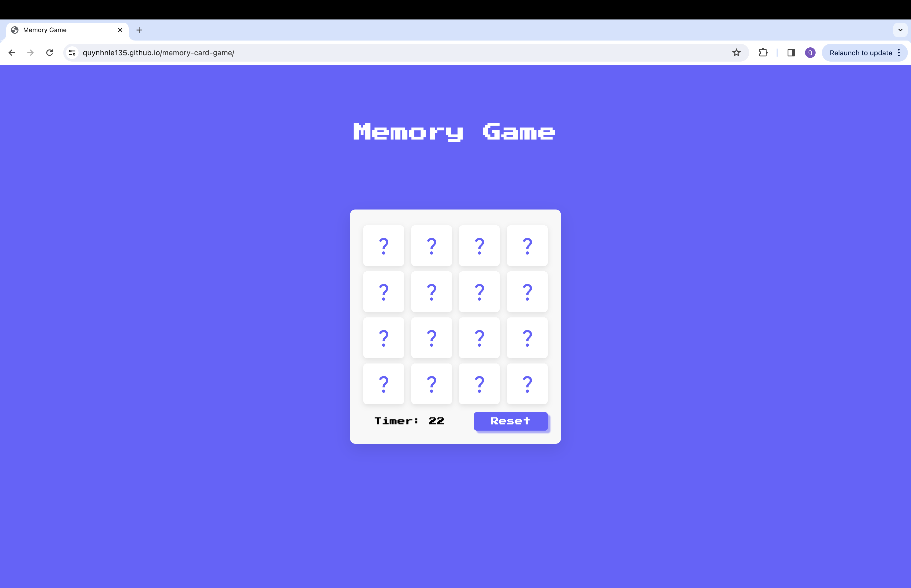
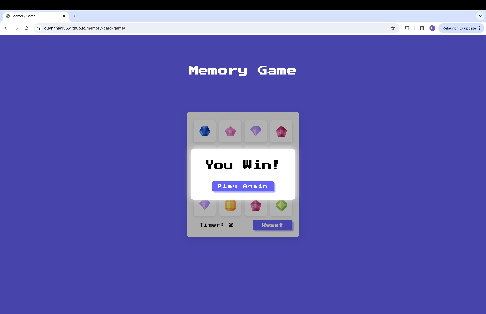
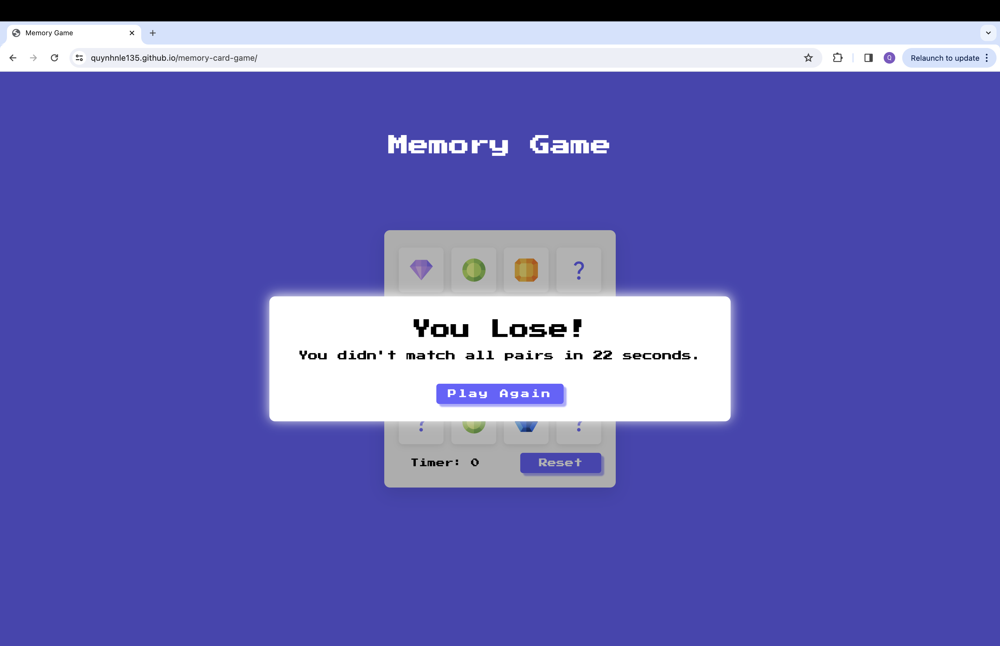

# Memory Game 

## Overview
Memory Game is a classic card matching game designed to test and improve your memory. It's built with HTML, CSS, and JavaScript, featuring a simple yet engaging interface that users of all ages can enjoy. This game challenges players to match 8 pairs of cards within 30 seconds.

&rarr; You can play it [here](https://quynhnle135.github.io/memory-card-game/)

## How to Play
1. Start the game by clicking the "Start Game" button.
2. Click on two cards to flip them over.
3. If the cards match, they will remain flipped. If they don't match, they will flip back over.
4. The game continues until all pairs are matched.
5. Try to match all pairs under 30 seconds.

## Technologies Used
- HTML5
- CSS3
- JavaScript

## Screenshots

### When user starts playing

### When user wins

### When user loses

